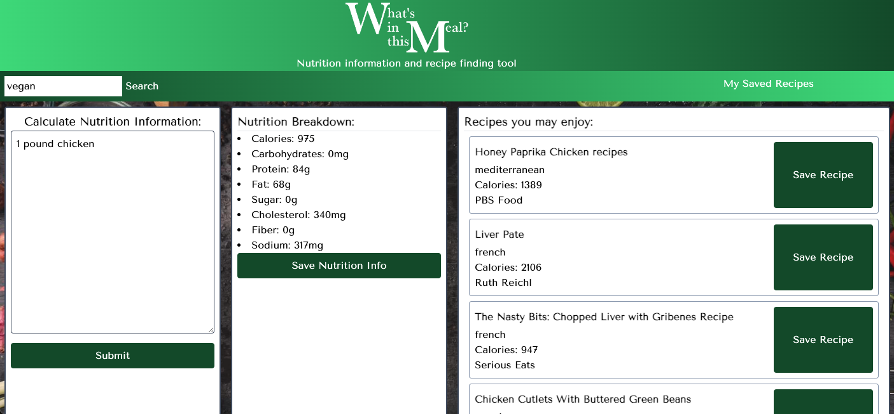
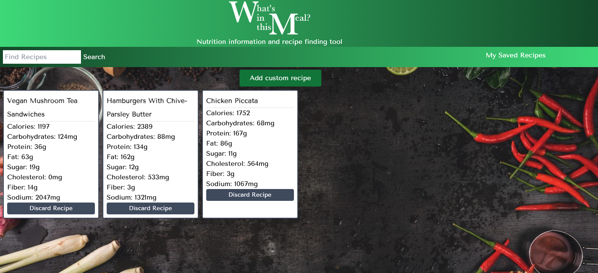

# What's in this Meal?

## User Story:
As a cook or diet-conscious eater, I want to easily evaluate the nutritional content of recipe ingredients and/or find recipes that fit my available ingredients or other specifications.

## Description
For our project, we decided to make a website that finds and displays relevant nutrition data based on ingredients. The user may search for a recipe or paste an ingredients list in the text box. The user may also save their searched recipes. When 'My Saved Recipes' is clicked, the user is presented with a recipe box modal which autofills the selected data, allows the user to edit as wished, and saves.

On the main HTML page, we have 3 sections. The first is for searching a food or ingredient. The user can copy/paste or type in ingredients and quantities, and receive nutritional data about those ingredients in combination. The second section renders the relevant data to the page: calories, carbohydrates, protein, fat, sugar, cholesterol, fiber, and sodium. The last section on the main page provides recipes based upon the search results of the ingredient(s). The 'Recipes You May Enjoy' section includes the names of 5 recipes, a calorie count for each, a link to the recipe's source website, and a 'save recipe' button. When the user clicks the 'save recipes' button, a pre-filled, editable modal form appears, and the user can then save all info. The 'My Saved Recipes' tab in the navigation bar brings the user to the saved recipes page. There, all the recipes are rendered onto recipe cards. At the top of the page, there a button that triggers an empty modal, which allows the user to input a custom recipe from scratch. The input from this gets displayed on the page in the same way as the other recipes that were searched using the site. Through the header and navbar, the user can initiate another search and/or navigate back to the main page easily.

## Technologies used: 
HTML, CSS, JavaScript
https://rapidapi.com/edamam/api/edamam-nutrition-analysis  
https://rapidapi.com/edamam/api/recipe-search-and-diet/  
https://tailwindcss.com/  
https://fonts.google.com/noto/specimen/Noto+Serif?query=noto  
https://new.express.adobe.com

## Group 4 roles: 
Beth - Project manager/HTML/CSS  
Max - HTML/CSS  
Ivan - JS  
Josh - JS

## Link to live site:
https://bdeutmeyer.github.io/nutrition-getter/

## Screenshot:

## Credits:
The application's styling was done with the outside assistance of Tailwind CSS and Google Fonts. All nutritional and recipe data came through Edamam's Nutrition Analysis and Recipe Search APIs. The script.js file utilizes the Fisher-Yates shuffle algorithm, noted there by a comment. The background image source is: https://static.vecteezy.com/system/resources/previews/003/823/542/non_2x/spices-for-use-as-cooking-ingredients-on-a-wooden-background-with-fresh-vegetables-healthy-food-herbs-organic-vegetables-on-the-table-raw-materials-of-cooking-preparation-tom-yum-free-photo.jpg . The logo was created using Adobe Express.